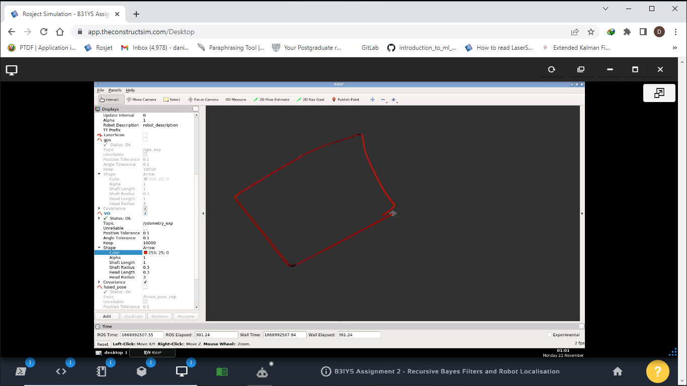
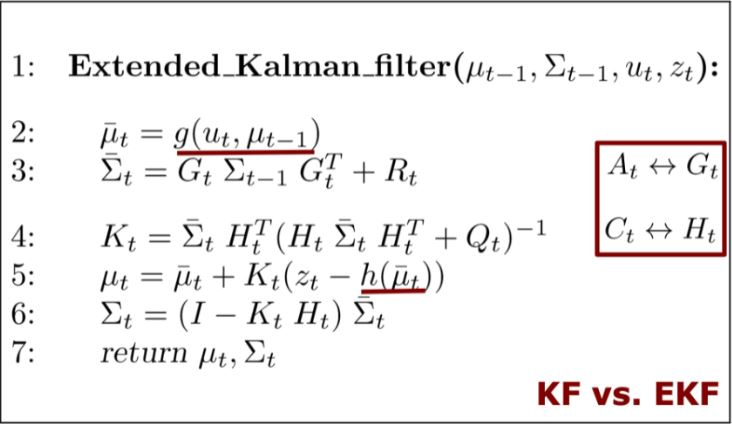
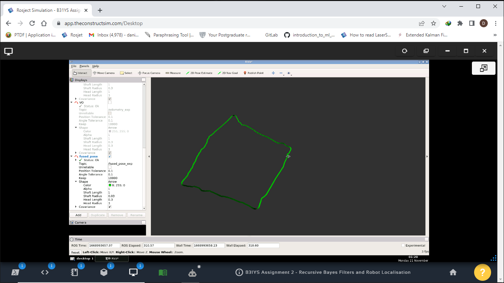
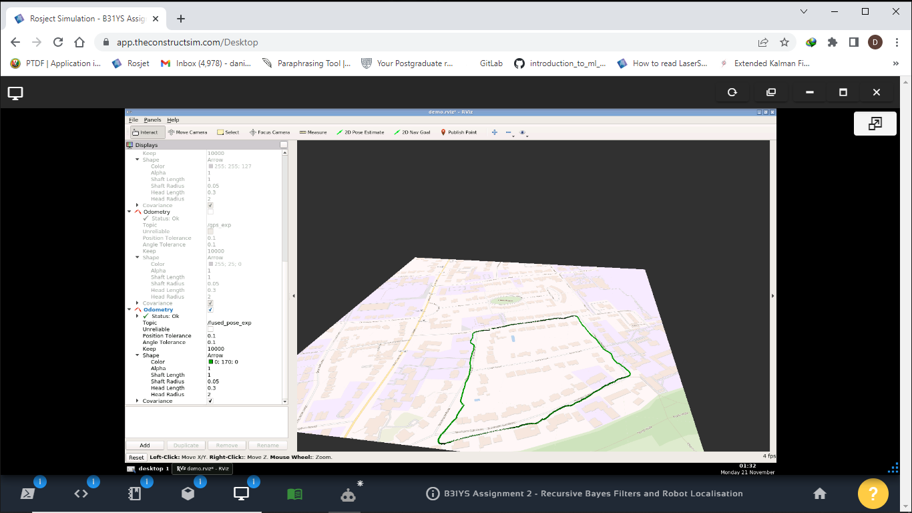
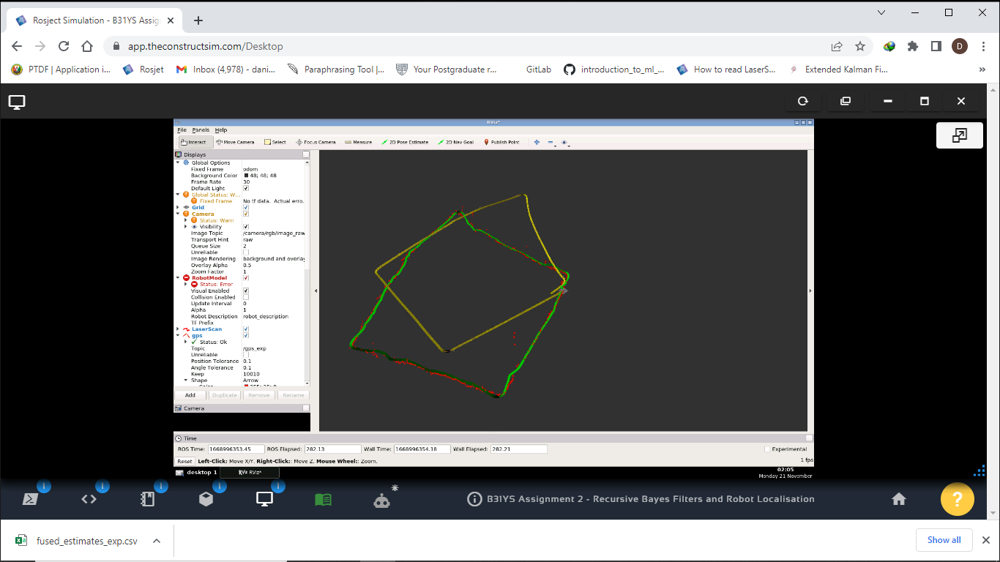
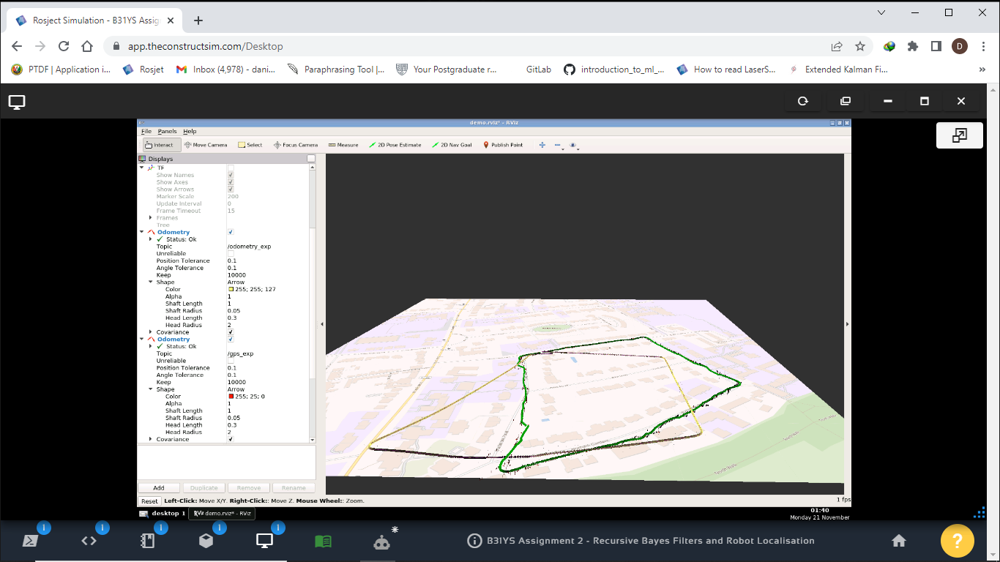
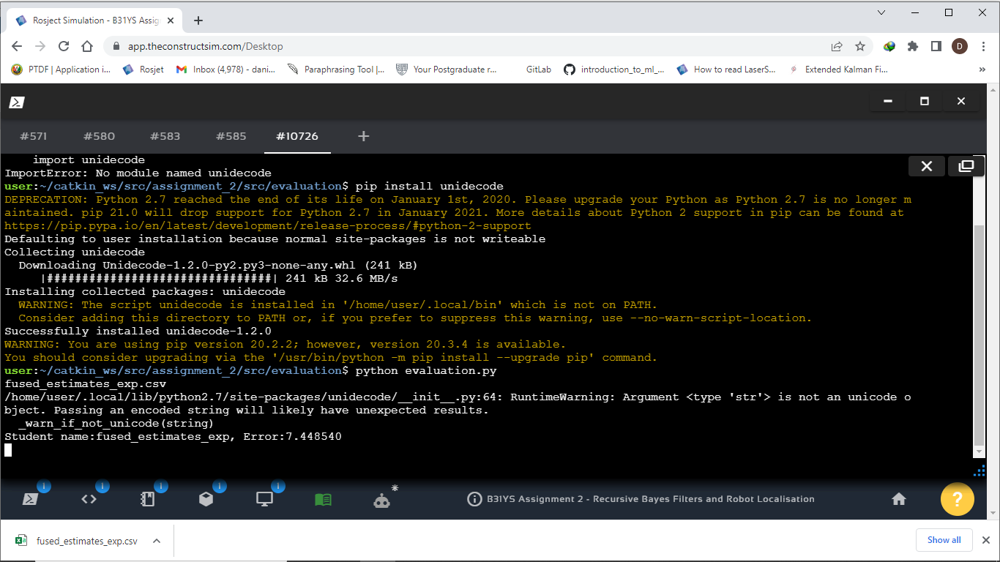
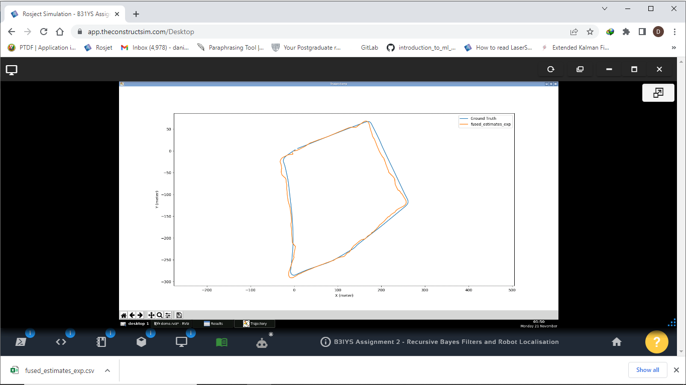
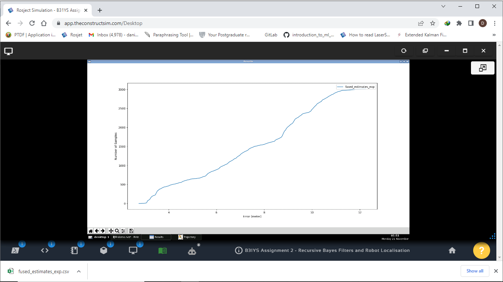
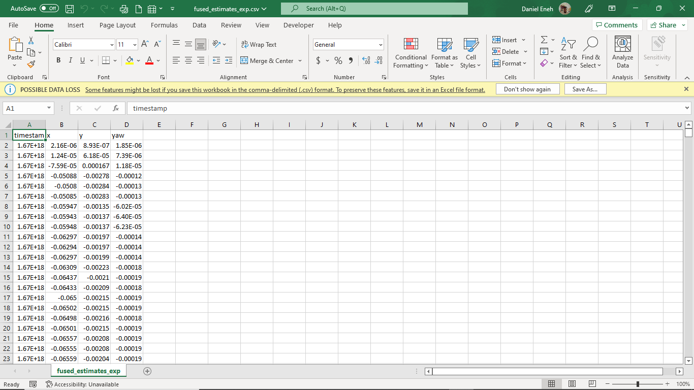

# Extended-Kalman-Filter-for-GPS-and-Odometry-signals


## Background
Single sensor has limited capabilities. In the context of robot localisation, for example, robot odometry drifts over time. Although GPS provides global positions, it can only achieve moderate accuracy locally and suffers from noises due to building occlusion, dense trees etc. Moreover, normal GPS only has about several meters accuracy, which is not enough for many robotic applications. Therefore, recursive Bayes filter based multi-sensor fusion is often used to fuse odometry with GPS for outdoor mobile robotics, reducing the drifts of odometry and smoothing GPS locations.

### Dependencies
[ROS Noetic](http://wiki.ros.org/noetic)
<br></br>
[Ubuntu 20.04](https://releases.ubuntu.com/focal/)

### Objective
This Assignment focuses on developing an Extended Kalman filter (EKF) algorithm to fuse robot visual odometry and GPS for accurate robot localisation. It aims to consolidate the lectures by practicing and understanding how to design and tune a filter to solve a real-world problem. Since this Assignment is provided with some real robot data, the algorithms developed can be easily tested and deployed on real robots.

## ROS Bag Dataset
[Oxford Robot car Dataset](https://robotcar-dataset.robots.ox.ac.uk/)
<br></br>
[Robot Documentation](https://robotcar-dataset.robots.ox.ac.uk/documentation/)

## Rostopics
1. Visual odometry topic _/visual_odometry_
2. GPS topic _/gps_
3. Camera image topic _/image_centre_

### Dependencies
[ROS Geonav](https://wiki.ros.org/geonav_transform) to convert latitude and longitude into XYZ coordinates.

## Note
The ROSBag assignment2.bag is in the datasets_ws folder of this project. You can use the rosbag play command to play the data for your assignment. The rosbag play assignment2.bag> will start the replay of the bag. Therefore you should start your filtering node before you start playing the rosbag.

## Visualize Visual Odometry
```
1. roscore #Terminal 1
2. rosrun assigment2 ekf_node.py #Terminal 2
3. rosrun rviz rviz #Terminal 3 (Ensure the visual odometry topic is checked with color red on rviz)
4. rosbag play dataset_ws/assignment2.bag #Starts the rosbag
Terminate all the terminals using Ctrl + C
```


## Visualize GPS
```
1. roscore #Terminal 1
2. rosrun assigment2 ekf_node.py #Terminal 2
3. rosrun rviz rviz #Terminal 3 (Ensure the visual odometry topic is checked with color green on rviz)
4. rosbag play dataset_ws/assignment2.bag #Starts the rosbag
Terminate all the terminals using Ctrl + C
```
### EKF formula used 


### Visualize fused pose
```
1. roscore #Terminal 1
2. rosrun assigment2 ekf_node.py #Terminal 2
3. rosrun rviz rviz #Terminal 3 (Ensure the fused_pose topic is checked with color green on rviz)
4. rosbag play dataset_ws/assignment2.bag #Starts the rosbag
Terminate all the terminals using Ctrl + C
```


### Using RViz Sattellite Package
```
1. roscore #Terminal 1
2. rosrun assigment2 ekf_node.py #Terminal 2
3. roslaunch rviz_satellite assignment_2.launch # Terminal 3 (Ensure the fused_pose topic is checked with color green on rviz)
4. rosbag play dataset_ws/assignment2.bag #Starts the rosbag
Terminate all the terminals using Ctrl + C
```





### Comparing with Ground truth
```
1. pip install unidecode
2. cd catkin_ws/src/assignment_2/src/evaluation
3. python evaluation.py
Terminate all the terminals using Ctrl + C
```
**The error**


**Ground Truth and fused_pose**







### Convert Fused posed estimate to dataframe
```
import pandas as pd

# Read the CSV file into a DataFrame
df = pd.read_csv('data.csv')

# Display the DataFrame
print (df)
```

